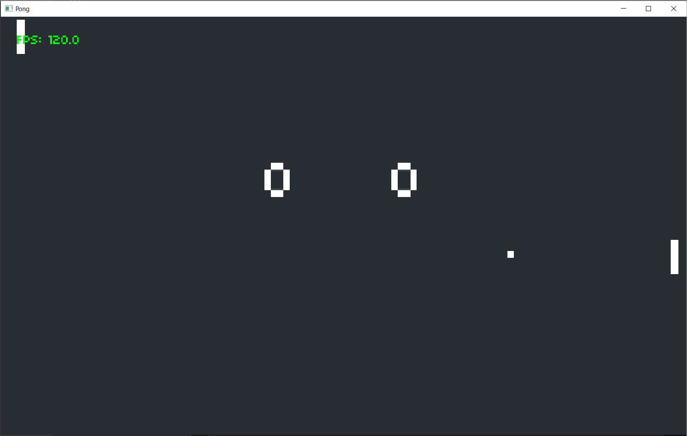

# Learning Game Development, ECS and Rust

This repository contains the code I write while learning game development, ECS architectures and Rust. I have no experience in any of these things, so don't expect this code to be of very high quality.

The game logic and assets are all based on [CS50's Introduction to Game Development](https://courses.edx.org/courses/course-v1:HarvardX+CS50G+Games/course/) course on edX.

My goal is to implement all the 2D games (lecture 1-8) from that course in Rust using the [GGEZ](https://ggez.rs/) game engine and the [Specs ECS](https://specs.amethyst.rs/) library. The main reason I am doing this is to learn the Rust language and experiment with ECS architectures in general.

## Implemented GD50 games
- [x] Pong
- [x] Flappy Bird
- [ ] Breakout
- [ ] Match 3
- [ ] Super Mario Bros
- [ ] Legend of Zelda
- [ ] Angry Birds
- [ ] Pokemon

## Running the games
Clone the repository and run `cargo run -p [game-name]`. E.g. to start pong run `cargo run -p pong`.

## Progressive feature implementation

The idea is to try out some new features and concepts in each game, and make them progressively more advanced in terms of ECS usage.

### Pong
- setup `ggez` and `Specs ECS` in rather basic way
- handle basic `keyboard input`
- uses the concept of `scenes`
- load `custom fonts`
- render `rectangle` and `text` entities in `draw` methods
- uses `sounds` in various systems.

### Flappy Bird
- implement a `RenderSystem` with z-index sorting
- render `images`
- `rotate` images around their center
- add a `parallax` effect system

